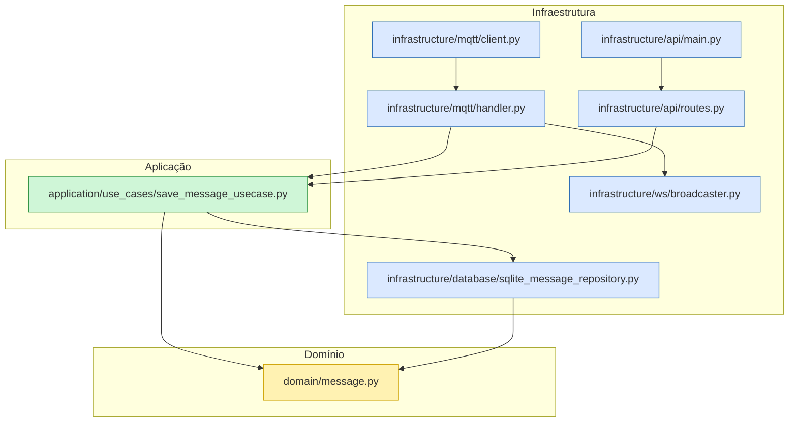

# Sensor Grid

## Visão Geral

Projeto de monitoramento de telemetria baseado em arquitetura event-driven

- Backend: FastAPI
- Broker MQTT: Mosquitto (ou qualquer compatível)
- Persistência: SQLite
- Comunicação em tempo real: WebSocket broadcast

## Estrutura de pastas

- `application/`
  - `use_cases/` - casos de uso de domínio (regra de negócio)
  - `ports/` - portas/contratos de interfaces
- `domain/` - entidades de domínio (`message.py`)
- `infrastructure/`
  - `mqtt/` - cliente e handler MQTT
  - `api/` - FastAPI app, rotas e inicialização
  - `database/` - repositório SQLite
  - `ws/` - broadcasting WebSocket
- `templates/` - frontend via Jinja2

## Configuração de ambiente

1. Criar arquivo `.env` no root:

```ini
MQTT_HOST=127.0.0.1
MQTT_PORT=1883
MQTT_CLIENT_ID=Backend_FastAPI
```

2. Instalar dependências:

```bash
pip install -r requirements.txt
```

3. Iniciar broker MQTT (ex: Mosquitto).

> Atenção: este projeto depende de um broker MQTT em execução. Instale e inicie o Mosquitto antes de rodar o backend.
>
> Exemplo Windows (PowerShell):
> ```powershell
> mosquitto -v
> ```
>
4. Iniciar aplicativo:

```bash
uvicorn infrastructure.api.main:app --reload
```

## Comportamento do fluxo (arquitetura event-driven)

- Sensor publica em `maquina/#` no MQTT.
- `infrastructure/mqtt/client.py` conecta e registra callbacks.
- `infrastructure/mqtt/handler.py` processa eventos:
  - converte payload
  - chama `SaveMessageUseCase` para persistir
  - determina status crítico/normal
  - emite evento via `broadcast_event` para WebSocket
- Rotas FastAPI podem consultar dados e status.

## Mermaid (diagrama de arquitetura backend)

Inclua em `README.md` ou em ferramenta Mermaid:



